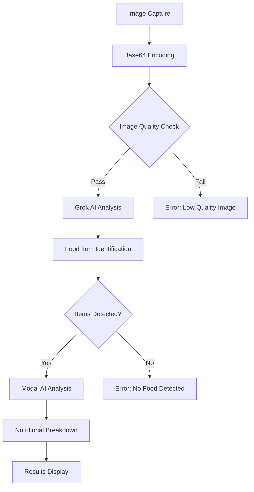

# AI-Powered Food Analysis

VitalMatrix leverages advanced AI technologies to analyze food images and provide comprehensive nutritional information. Our dual AI integration enables precise food identification and detailed nutritional analysis.

## Technology Stack

VitalMatrix combines two powerful AI services:

1. **Grok AI**: For advanced computer vision and food item identification
2. **Modal AI**: For detailed nutritional analysis and portion estimation

This dual approach provides more accurate results than either system could achieve independently.

## How It Works

### Image Processing Flow



### Step-by-Step Process

1. **Image Acquisition**:
   - User captures a photo or uploads an existing image
   - Image is converted to Base64 format for API transmission

2. **Grok AI Analysis**:
   - Base64 image is sent to our `/api/ai-analyze-food` endpoint
   - Grok AI processes the image to identify food items
   - Each food item is identified with confidence scores

3. **Modal AI Nutritional Analysis**:
   - Identified food items are sent to Modal AI
   - Modal provides detailed nutritional information
   - Portion sizes are estimated based on visual cues

4. **Results Processing**:
   - Combined data is formatted into a user-friendly structure
   - Nutritional information is categorized by food item
   - Confidence scores determine display prominence

## Key Features

### Multi-Item Detection

The system can identify multiple food items within a single image:

```json
{
  "foodItems": [
    {
      "name": "Apple",
      "confidence": 0.97,
      "nutrition": {
        "calories": 95,
        "protein": 0.5,
        "carbs": 25,
        "fat": 0.3,
        "fiber": 4.4
        // Additional nutritional details
      }
    },
    {
      "name": "Greek Yogurt",
      "confidence": 0.89,
      // Nutritional details
    }
  ]
}
```

### Confidence Scoring

Each identified item includes a confidence score to indicate the AI's certainty:

- **High Confidence** (0.9-1.0): Very reliable identification
- **Medium Confidence** (0.7-0.89): Likely correct, but may have similar alternatives
- **Low Confidence** (<0.7): Tentative identification, may require user confirmation

### Nutritional Breakdown

For each identified food item, the system provides comprehensive nutritional information:

- Macronutrients (protein, carbs, fat)
- Micronutrients (vitamins, minerals)
- Caloric content
- Portion size estimates

## Implementation Details

The AI analysis functionality is implemented in the backend API route:

```typescript
// /api/ai-analyze-food.ts
export default async function handler(
  req: NextApiRequest,
  res: NextApiResponse
) {
  try {
    const { image } = req.body;
    
    // Step 1: Analyze image with Grok to identify food items
    const grokResponse = await analyzeImageWithGrok(image);
    
    if (!grokResponse.foodItems || grokResponse.foodItems.length === 0) {
      return res.status(400).json({ error: 'No food items detected' });
    }
    
    // Step 2: Get nutritional analysis with Modal
    const nutritionalData = await analyzeWithModal(
      image,
      grokResponse.foodItems
    );
    
    // Step 3: Combine and return results
    return res.status(200).json({
      foodItems: nutritionalData.items,
      totalNutrition: nutritionalData.total
    });
  } catch (error) {
    // Error handling
  }
}
```

## Performance Considerations

- **Image Compression**: Large images are compressed before sending to AI services
- **Result Caching**: Common food items are cached to improve response times
- **Progressive Loading**: UI displays initial results while detailed analysis completes

## Privacy and Data Security

- Images are processed in memory and not stored permanently unless explicitly requested
- Personal data is not associated with food analysis requests
- API keys for AI services are securely managed on the server side

## Limitations and Future Improvements

- Currently optimized for individual food items rather than complex dishes
- Working on improved mixed-dish analysis for multi-component meals
- Developing personalized nutritional recommendations based on analysis history
- Expanding our food database for more region-specific items
